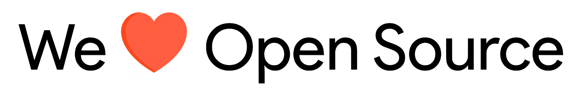

# jeyspecialneedscentre-backend

<p align="center">
    
    <br>Backend server for <a href="https://jeyspecialneedscentre.com/">Jey special needs centre</a>, built on Django
</p>

---

<p align="center">
    <a href="https://github.com/SVijayB/jeyspecialneedscentre-backend/pulls">
        
    </a>
<a href="https://github.com/SVijayB/jeyspecialneedscentre-backend/issues">
    
    </a>
<a href="https://github.com/SVijayB/jeyspecialneedscentre-backend/graphs/contributors">
    
    </a>
<a href="https://github.com/SVijayB/jeyspecialneedscentre-backend/blob/master/LICENSE">
    
    </a>
<a href="https://github.com/SVijayB/jeyspecialneedscentre-backend">
    
    </a>
<a href="https://github.com/SVijayB/jeyspecialneedscentre-backend/blob/master/.github/CODE_OF_CONDUCT.md">
    
    </a>
<a href="https://github.com/SVijayB/jeyspecialneedscentre-backend/blob/master/.github/CONTRIBUTING.md">
    
    </a>
</p>

## Table of Contents

-   [Motivation](#Motivation)
-   [Installation](#Installation)
-   [Usage](#Usage)
    -   [Project Demo](#Demo)
-   [Contributing](#Contributing)
-   [License](#License)

## Motivation

<!--- Insert product screenshot below --->

<!--  -->

Jey Special Needs Centre provides ABA services for children with Autism, ADHD, Down syndrome, Cerebral palsy, Learning Disability, based on the science of Applied Behavior Analysis (ABA). Their mission is to empower children with special needs to reach their full potential and lead fulfilling lives.

This repository contains the backend code for their management system, built using Django. It handles user authentication, data management, and serves as the backbone for the web application.


## Installation

### Prerequisites
- Python 3.11+ 
- MongoDB Atlas account (free tier available)
- Git

### Setup

1. **Clone the repository**
```bash
git clone https://github.com/SVijayB/jeyspecialneedscentre-backend
cd jeyspecialneedscentre-backend
```

2. **Create and activate virtual environment**
```bash
python -m venv .venv

source .venv/bin/activate
```

3. **Install dependencies**
```bash
pip install -r requirements.txt
```

4. **Environment Configuration**
```bash
# Copy the example environment file
cp .env.example .env

# Edit .env with your MongoDB Atlas URI and other settings
# See .env.example for all required variables
```

5. **Run migrations (if any)**
```bash
cd src
python manage.py migrate
```

6. **Start the development server**
```bash
python manage.py runserver
```

The API will be available at `http://localhost:8000`

## Contributing

To contribute to this repository, fork it, create a new branch and send us a pull request. Make sure you read [CONTRIBUTING.md](https://github.com/SVijayB/jeyspecialneedscentre-backend/blob/master/.github/CONTRIBUTING.md) before sending us Pull requests.

Thanks for contributing to Open-source! ❤️

## License

This repository is under The GPL-3.0 License. Read the [LICENSE](https://github.com/SVijayB/jeyspecialneedscentre-backend/blob/master/LICENSE) file for more information.

---


